# Event Marketplace

## Project Overview

This project aims to develop an event marketplace where organizers can share their upcoming events and users can register for it. The platform is designed to facilitate seamless interaction between event organizers and attendees. It offers a range of features aimed at enhancing the user experience and streamlining event management for organizers.

## Software Requirements Specifications 
This section describes the requirements for the software project. The created software must be
able to perform the following functional requirements (abbreviated as FR):

**FR 1: User Experience**
- FR 1.1: User can view the list of upcoming events with key details.
- FR 1.2: User can sign up for events.
- FR 1.3: User can filter for events based on preference.

**FR 2: Event Organizer Dashboard**
- FR 1.1: Event Organizer can view the list of active and past events they have listed.
- FR 1.2: Event Organizer can add new event listing, update old listing or delete listings.
- FR 1.3: Event Organizer can view the list of users who have signed up for a specific event.

## Prototype

**Homepage**
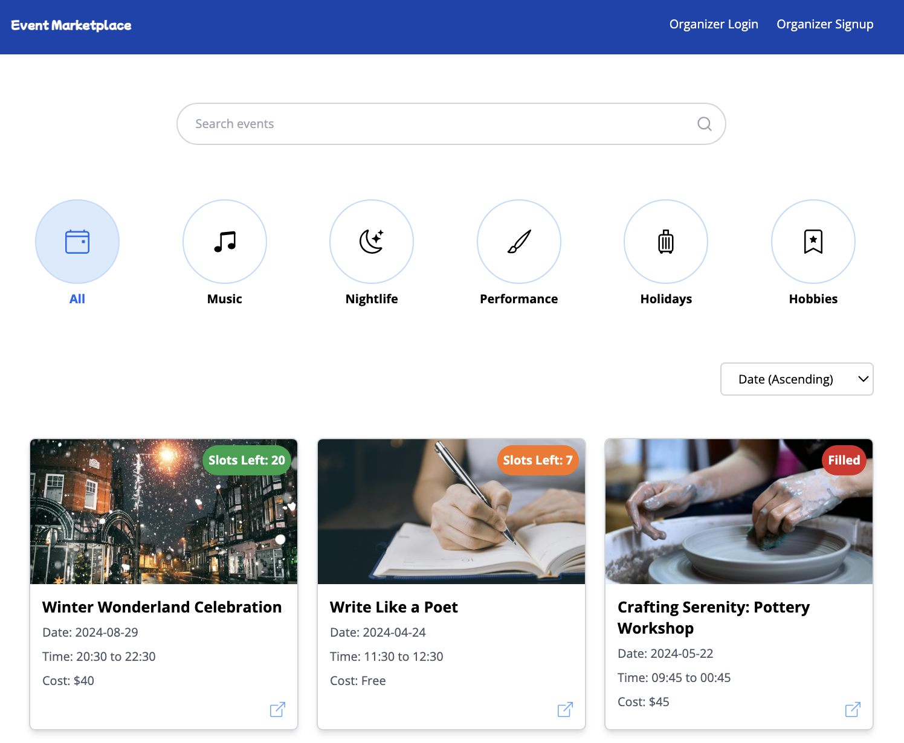

**View Event Page**
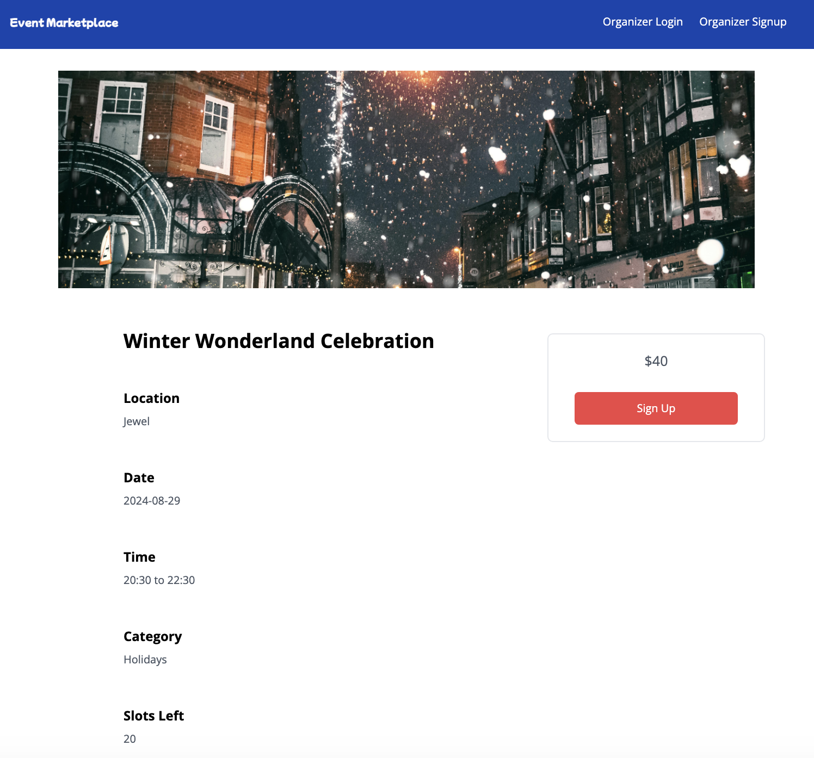

**Sign Up Form**
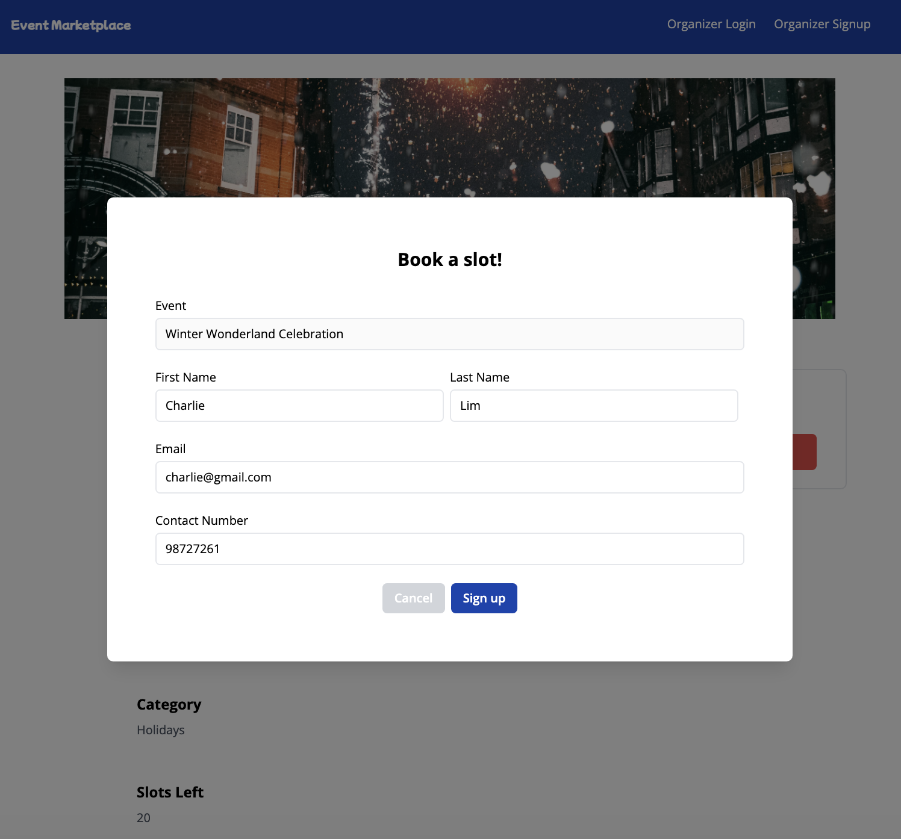

**Event Organizer Sign Up**
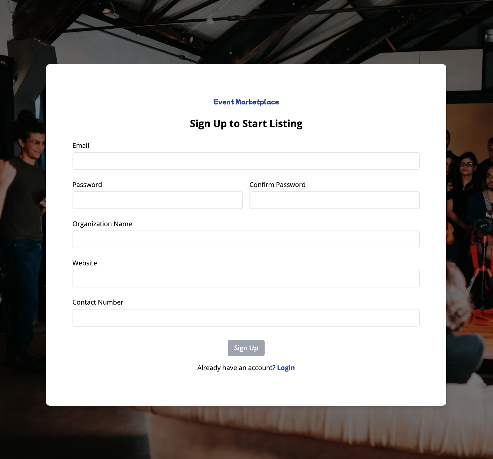

**Event Organizer Login**
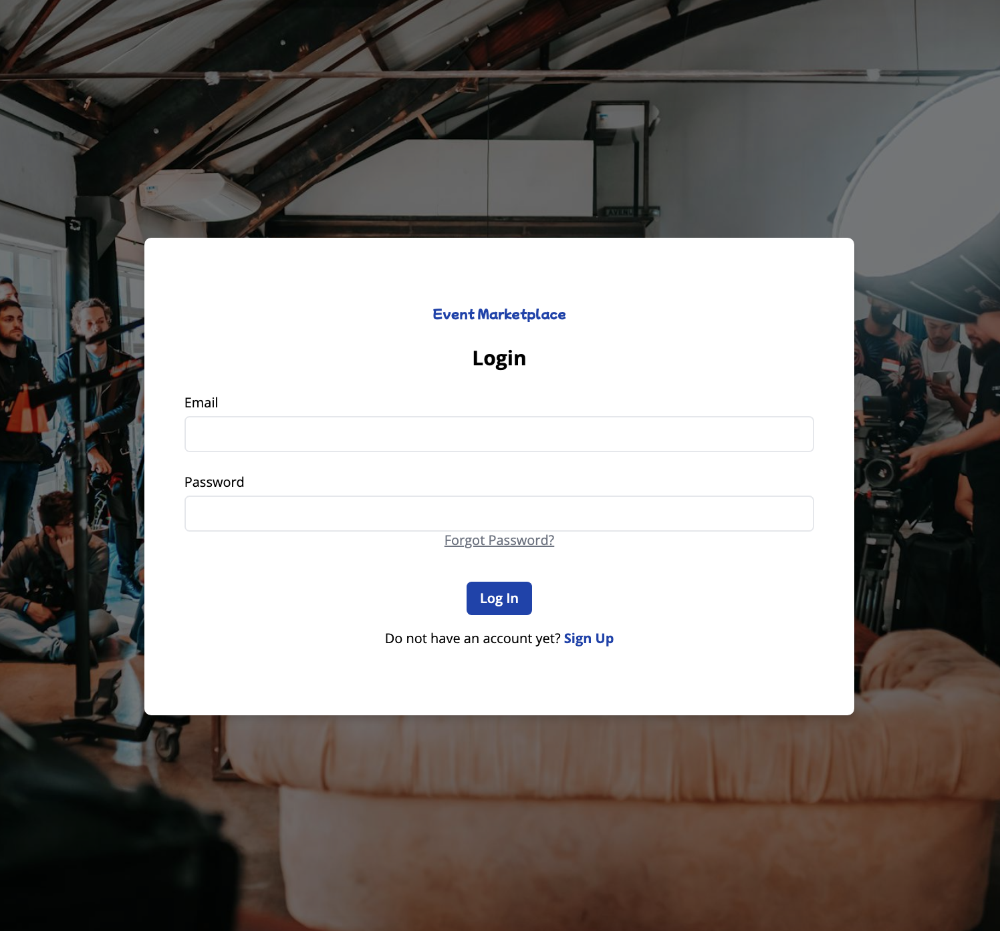

**Forgot Password**
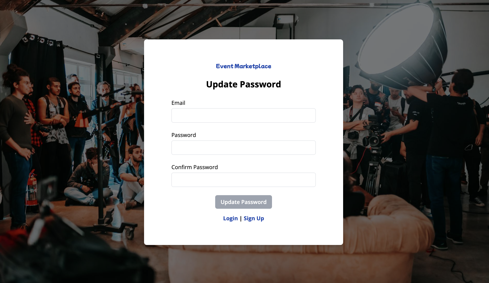

**Dashboard**
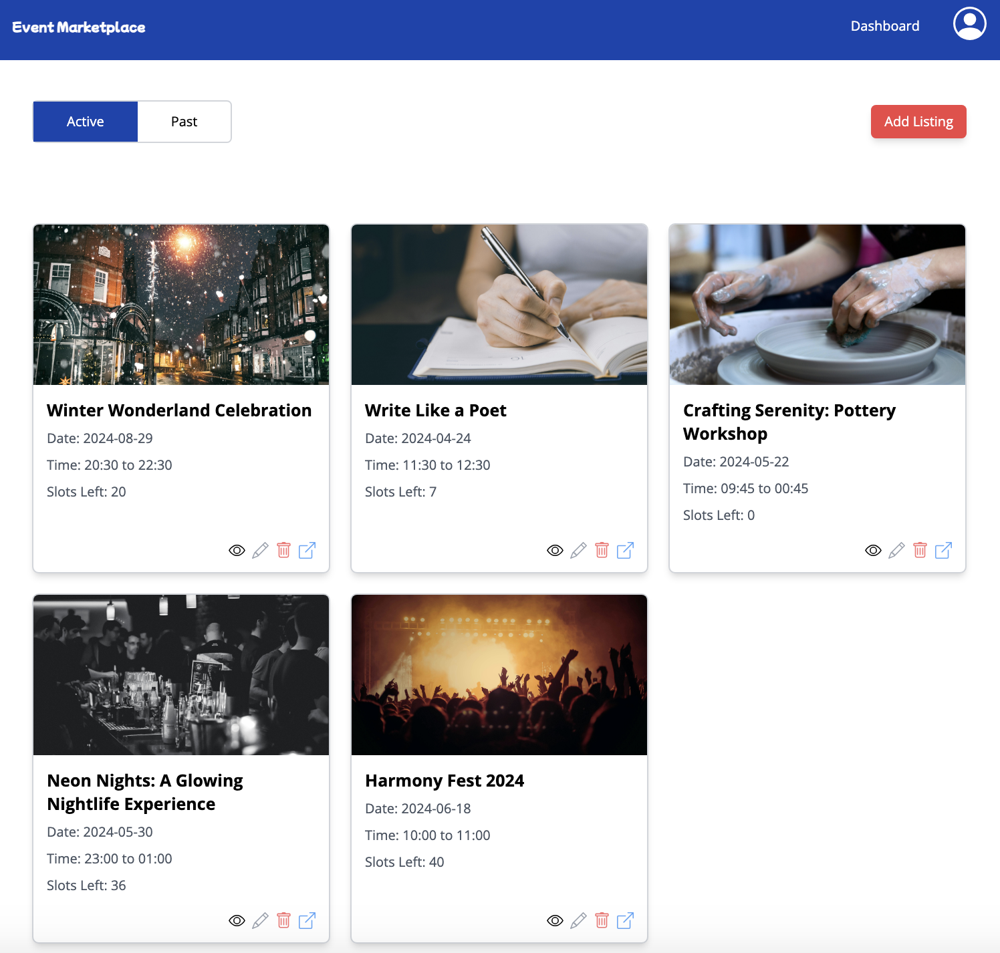

**List New Event**
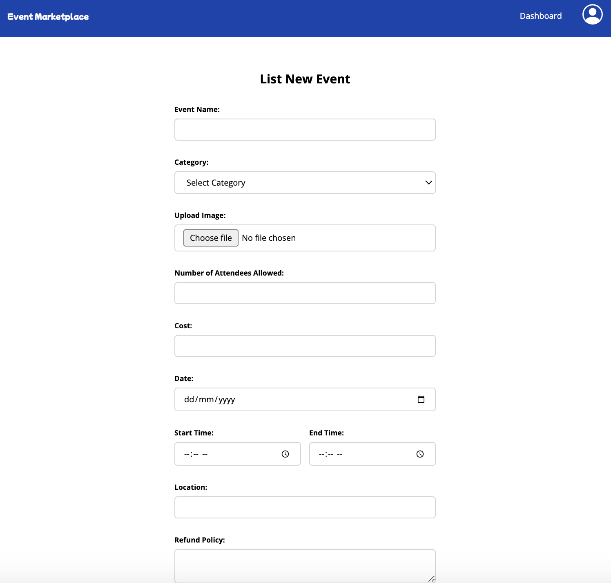

**View Listed Event**
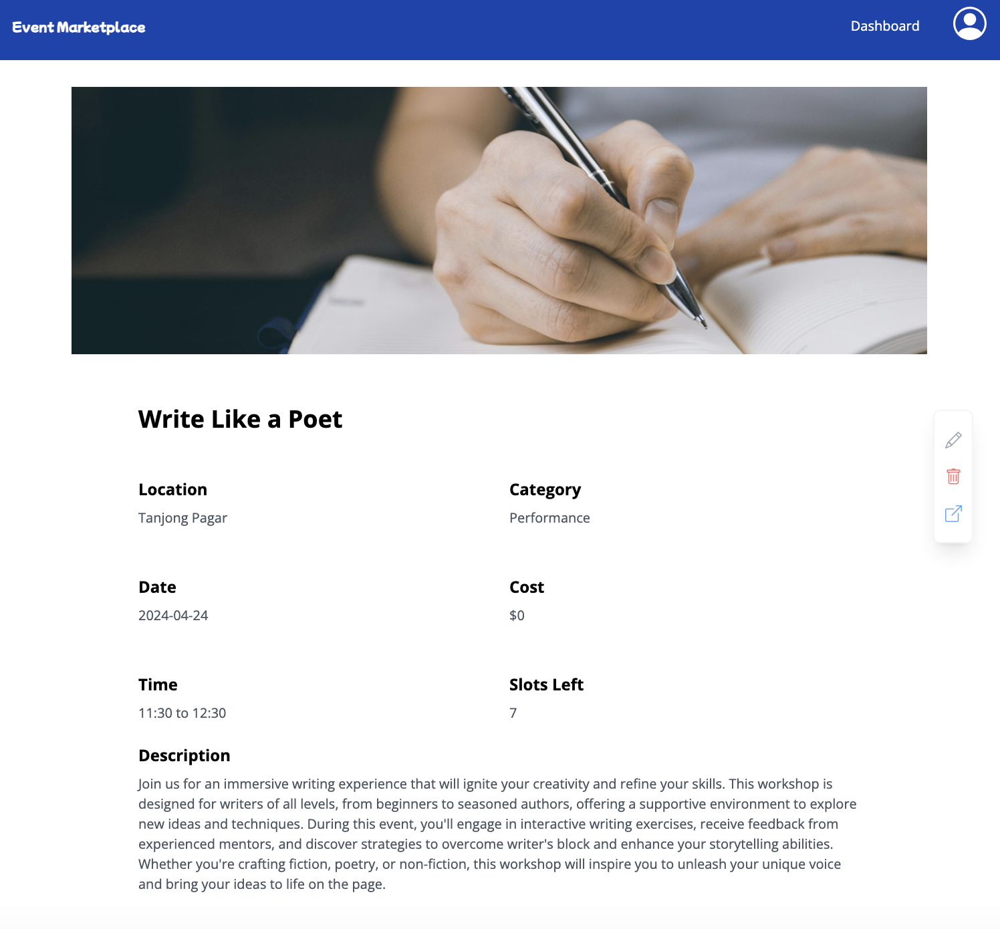

**View Sign Up List**
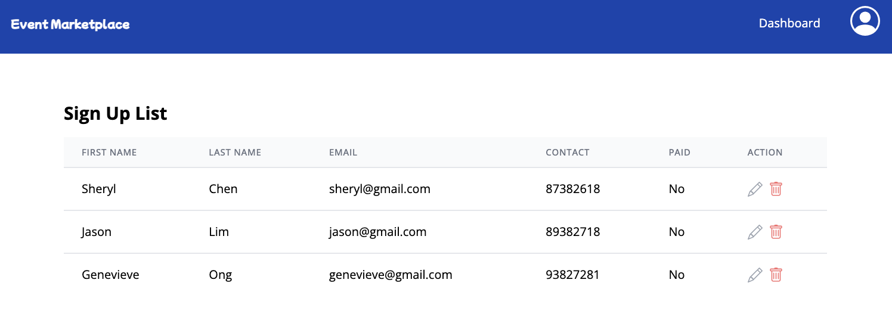

**Delete Confirmation**
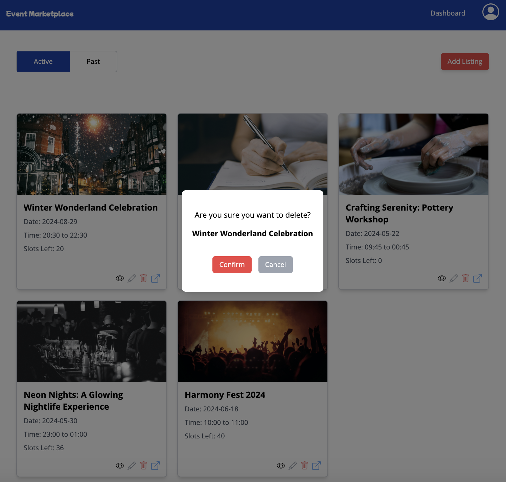

## Technologies Used

- Angular
- Tailwind CSS
- Firebase
- TypeScript

## Future Implementations

### 1. Profile Updating
Enable organizers to update their profile information as needed, allowing for flexibility and keeping their information current.

### 2. Two-Factor Authentication (2FA)
Enhance security measures by implementing Two-Factor Authentication (2FA) to protect user accounts. Organizers will be required to verify their email address and a second factor, such as a mobile device, before gaining access to the system, adding an extra layer of security.

### 3. Stripe Payment Integration
Integrate Stripe payment gateway to facilitate secure and seamless transactions for event registrations and payments. This will provide users with multiple payment options and ensure a smooth payment process.

## Credits
This project drew inspiration from [Eventbrite](https://www.eventbrite.com/). Eventbrite's interface served as a guiding inspiration for the development of this Event Marketplace project.

## Work in Progress and Bugs
Below are some work in progress and bugs.

### General
- Refactoring components to use signals